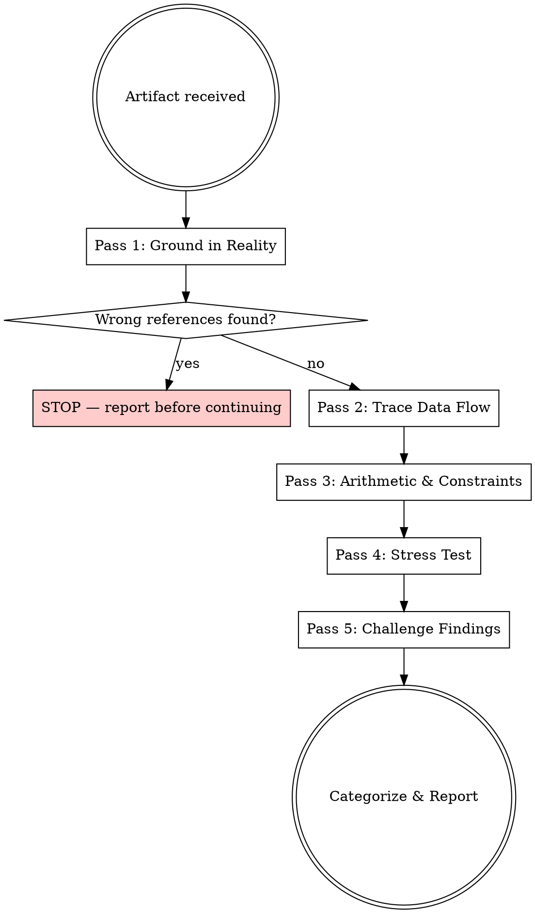

# Phoebe Review Protocol

Multi-pass review that enforces analytical depth. Prevents the shallow first-pass pattern where the user has to push back to surface obvious issues.

**Core principle:** Find at least one thing wrong or one question unasked. If the artifact is good, the stress test confirms it with evidence — not just agreement.

## When to Use

- Reviewing a spec, plan, or design document
- Reviewing implementation diffs before merge
- Answering "does this look right?" questions
- Before saying "Ship" or "looks good"

## The Protocol



### Pass 1 — Ground in Reality

Read all referenced files. For every symbol (function, struct, field, file path) in the artifact:
- Verify it exists via Read/Grep
- Verify its actual signature/type matches what the artifact assumes
- List every integration point

**Stop here if you find wrong references.** Report them before continuing.

### Pass 2 — Trace Data Flow

For every value produced by the proposed change:
- Where is it produced?
- How is it threaded to consumers?
- What happens if it's None/missing/zero?

Flag: values computed but never consumed (dead code), values consumed but never produced (missing wiring).

### Pass 3 — Arithmetic & Constraints

- Verify every numerical claim (totals, estimates, counts, thresholds). Show your work.
- Check sentinel values don't collide with valid IDs
- Check type consistency across FFI boundaries (Python float vs Rust f32/f64, int sizes)
- Verify accumulator routing categories are correct (keep/guard/guard-action/guard-shock/signal)

### Pass 4 — Stress Test

- What happens at turn 300 with 8 civs and 50K agents?
- What happens when a civ dies mid-turn? (regions = 0)
- What happens with `--agents=off`? Does determinism hold?
- What assumption am I not checking? If I can't name one, I haven't thought hard enough.

### Pass 5 — Challenge Your Findings

For each issue: attempt to disprove it by finding counter-evidence in the code. Issues that survive get categorized.

## Output Format

```
## Review — [Artifact Name]

### Verdict: [Ship / Ship with changes / Needs revision]

### Blocking (must fix)
[Numbered, with file:line evidence]

### Important (should fix)
[Numbered, with reasoning]

### Observations (non-blocking)
[Numbered]

### Verification Evidence
[What you checked and confirmed is correct — proves depth, not just criticism]
```

## Red Flags — You're Being Shallow

- About to say "looks good" without citing specific file:line evidence
- Haven't Read the actual source files referenced in the artifact
- Accepting a time estimate without listing concrete work items
- Asserting a dependency ordering without tracing runtime values at defaults
- Trusting a struct shape from memory instead of reading models.py
- Found zero issues — either the artifact is perfect (rare) or you haven't looked hard enough
